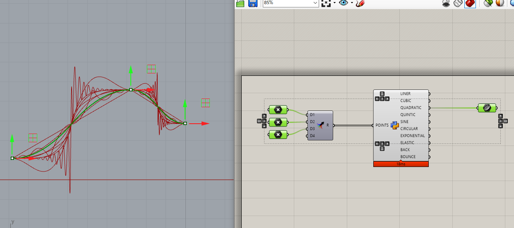

# GH_Easing  

キーフレームアニメーションの UI のスタディなどをしようと思って、点と点の間でのイージング関数を実装する。  

検索すると、以下のリンクのとおり、先人が実装済みのプログラムが落ちていたので、それをお借りし、Grasshopper での、Point3d とのやり取り、3つ以上の点での補間（2つの補間の繰り返しで正確であるのかは不明）などだけ少し自前で書いた。  

※ 3つ以上ある時は、In / Out を使い分けて書いたほうがいい場合もあるはず。 できるだけ少ない点で表現した方がよさそう。 

2点間でサンプリング数の適切さなどのちょっと怪しいが、一旦完成。  

  

### Src  

- zeffii/easing_p.py  
[https://gist.github.com/zeffii/c1e14dd6620ad855d81ec2e89a859719](https://gist.github.com/zeffii/c1e14dd6620ad855d81ec2e89a859719)

- warrenm / AHEasing  
[https://github.com/warrenm/AHEasing](https://github.com/warrenm/AHEasing)  

### Ref  

- Easing Functions Cheat Sheet  
[https://easings.net/](https://easings.net/)  
